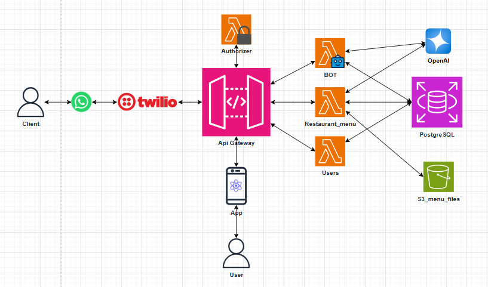
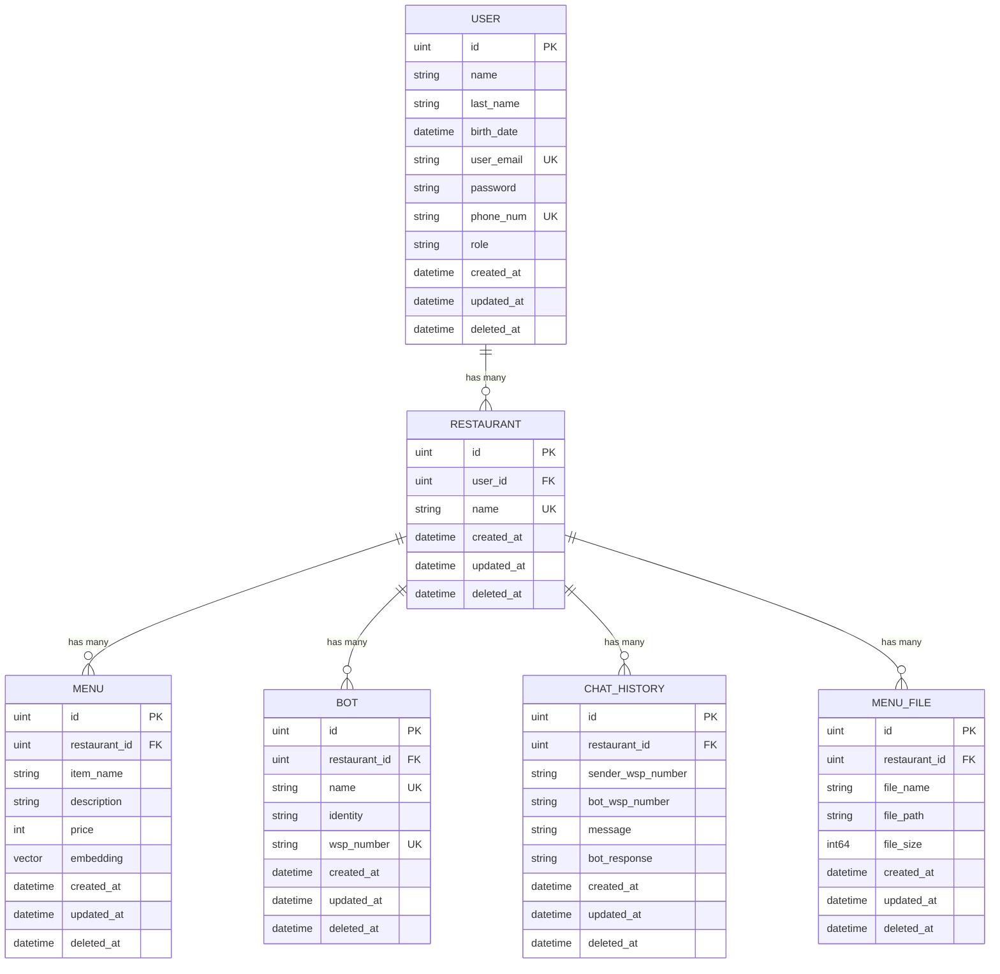

# Proyecto 01 - Backend

Restaurants Menu API

## Arquitectura del Backend

## DB Diagram

```mermaid
---
tittle: Restaurants Menu DB
---

erDiagram

    USER {
        uint id PK
        string name
        string last_name
        datetime birth_date
        string user_email UK
        string password
        string phone_num UK
        string role
        datetime created_at
        datetime updated_at
        datetime deleted_at
    }

    RESTAURANT {
        uint id PK
        uint user_id FK
        string name UK
        datetime created_at
        datetime updated_at
        datetime deleted_at
    }
    
    MENU {
        uint id PK
        uint restaurant_id FK
        string item_name
        string description
        int price
        vector embedding
        datetime created_at
        datetime updated_at
        datetime deleted_at
    }

    BOT {
        uint id PK
        uint restaurant_id FK
        string name UK
        string identity
        string wsp_number UK
        datetime created_at
        datetime updated_at
        datetime deleted_at

    }

    CHAT_HISTORY {
        uint id PK
        uint restaurant_id FK
        string sender_wsp_number
        string bot_wsp_number
        string message
        string bot_response
        datetime created_at
        datetime updated_at
        datetime deleted_at
    }

    MENU_FILE {
        uint id PK
        uint restaurant_id FK
        string file_name
        string file_path
        int64 file_size
        datetime created_at
        datetime updated_at
        datetime deleted_at
    }

    USER ||--o{ RESTAURANT : "has many"
    RESTAURANT ||--o{ MENU : "has many"
    RESTAURANT ||--o{ BOT : "has many"
    RESTAURANT ||--o{ CHAT_HISTORY : "has many"
    RESTAURANT ||--o{ MENU_FILE : "has many"
```

## Endpoints API