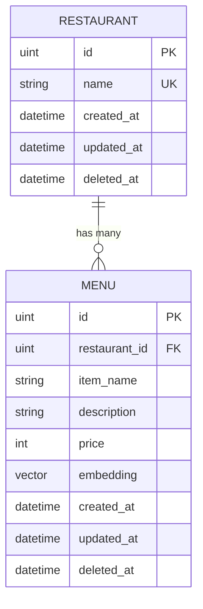

# Proyecto 01 - Backend

Restaurants Menu API

## DB Diagram

```mermaid
---
tittle: Restaurants Menu DB
---

erDiagram
    RESTAURANT {
        uint id PK
        string name UK
        datetime created_at
        datetime updated_at
        datetime deleted_at
    }
    
    MENU {
        uint id PK
        uint restaurant_id FK
        string item_name
        string description
        int price
        vector embedding
        datetime created_at
        datetime updated_at
        datetime deleted_at
    }

    RESTAURANT ||--o{ MENU : "has many"
```